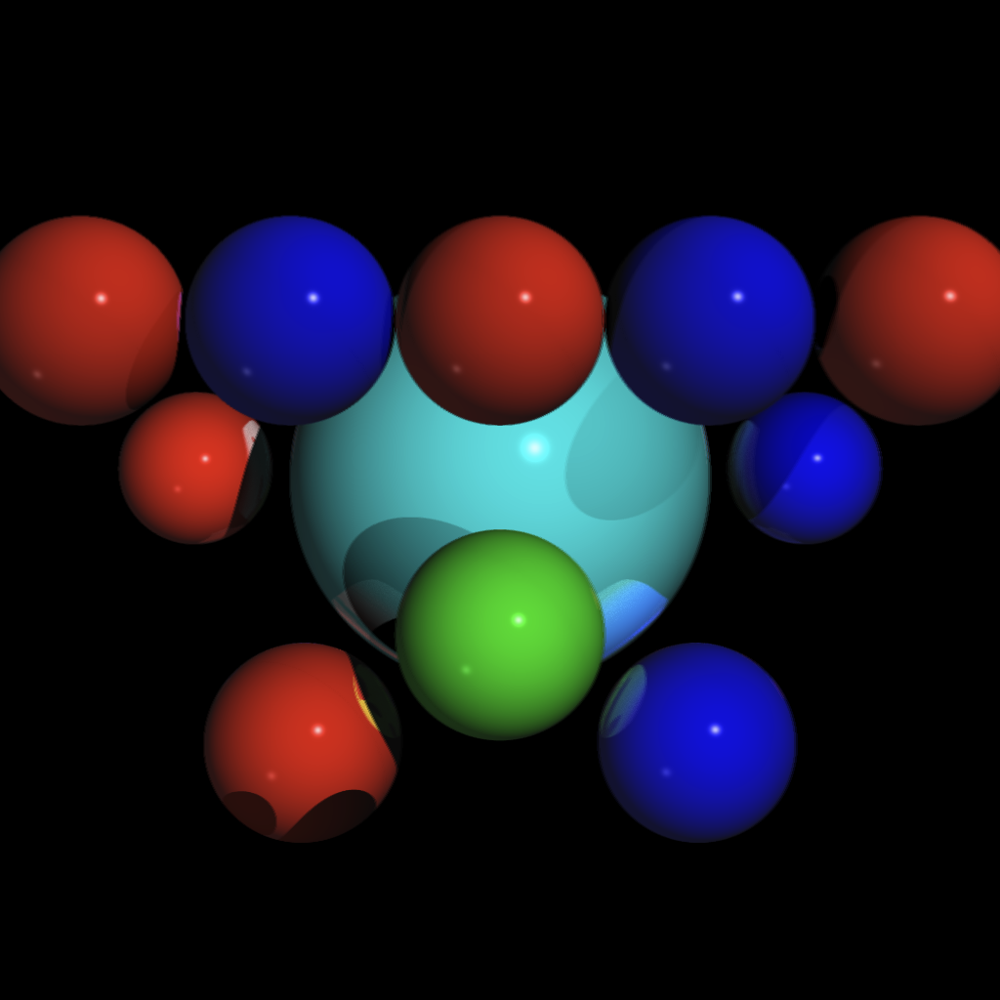
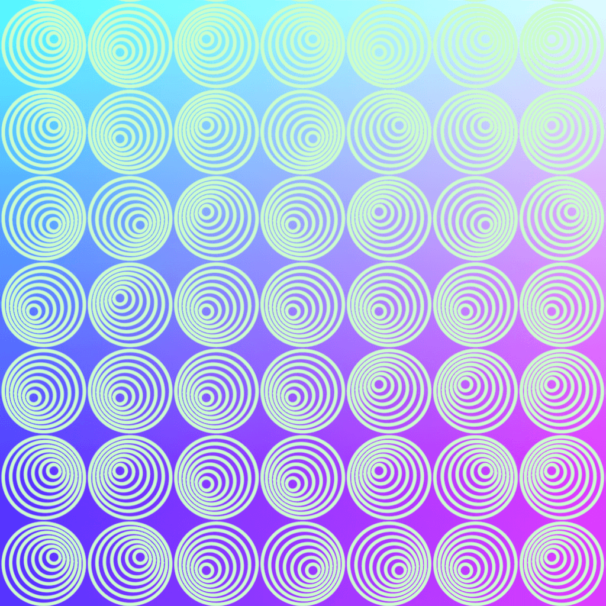
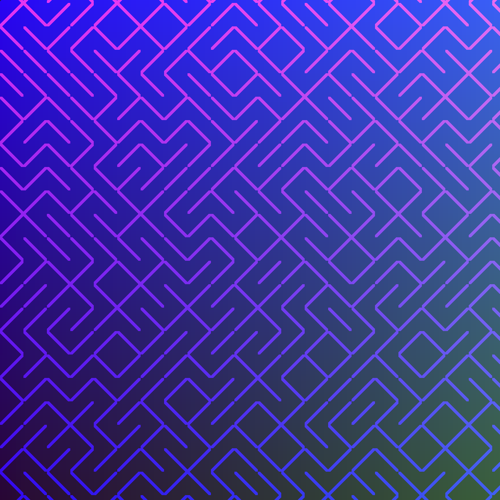
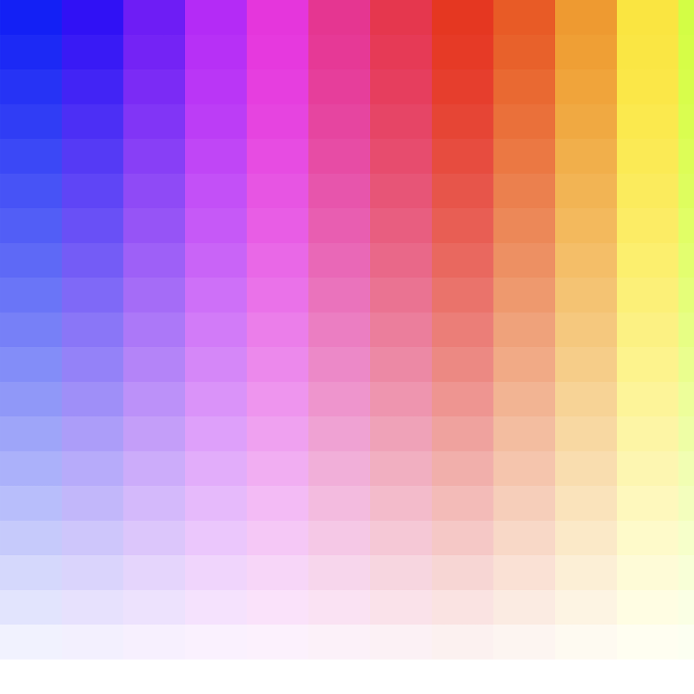
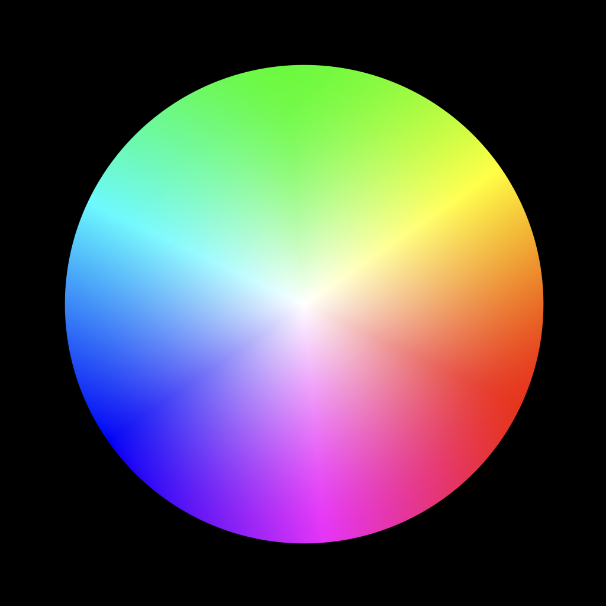

[shadertoy](https://www.shadertoy.com/) fragment shader experiments

## ray-tracer

an experiment to try and do ray tracing in the fragment shader
phong rendering seems to work, reflections and shadows need more attention iirc.

## nested-circles

series of inset circles animating to "point" in different orientations

## alternating-lines

maze-like pattern with changing fill and background colours

## colour-spectrum

animating phases of discrete colours

## colour-wheel

rotating colour wheel

## circle-radiuses

draws circles of various radiuses

## cubic-curves

tries to draw curves in x^3 and other shapes

## lines-waves

animation of lines turning into waves

## overlapping circles

animation of two nested circles overlapping
